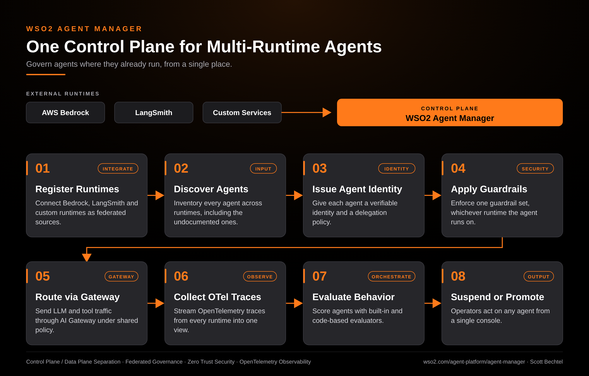

# Agent Manager: One Control Plane for Multi-Runtime Agents
**Date:** Monday, October 05, 2026  **Product:** [WSO2 Agent Manager](https://wso2.com/agent-platform/agent-manager/)

## Business Problem
Most enterprises already run agents on more than one runtime: a Bedrock agent in one team, a LangSmith-traced build in another, a custom service nobody documented. Each runtime has its own identity model, logging, and kill switch, so security ends up auditing three systems and still can't answer which agents exist. Agents that never hit a shared control plane become shadow systems.

## How WSO2 Solves This
WSO2 Agent Manager registers external runtimes as federated sources, so agents keep running where they are while governance moves to one place. Every discovered agent gets its own verifiable identity and delegation policy, and the same guardrails apply whether the agent runs on Bedrock, LangSmith, or your own code. OpenTelemetry traces and built-in evaluations flow into one view, which gives operators a single place to suspend or promote an agent. Self-host it or run it as SaaS, with no framework rewrite required.

## Patterns Used
- Control Plane / Data Plane Separation
- Federated Governance
- Zero Trust Security
- Centralized Observability (OpenTelemetry)

## Architecture

---
WSO2 Agent Manager · wso2.com/agent-platform/agent-manager ·  by, Scott Bechtel
