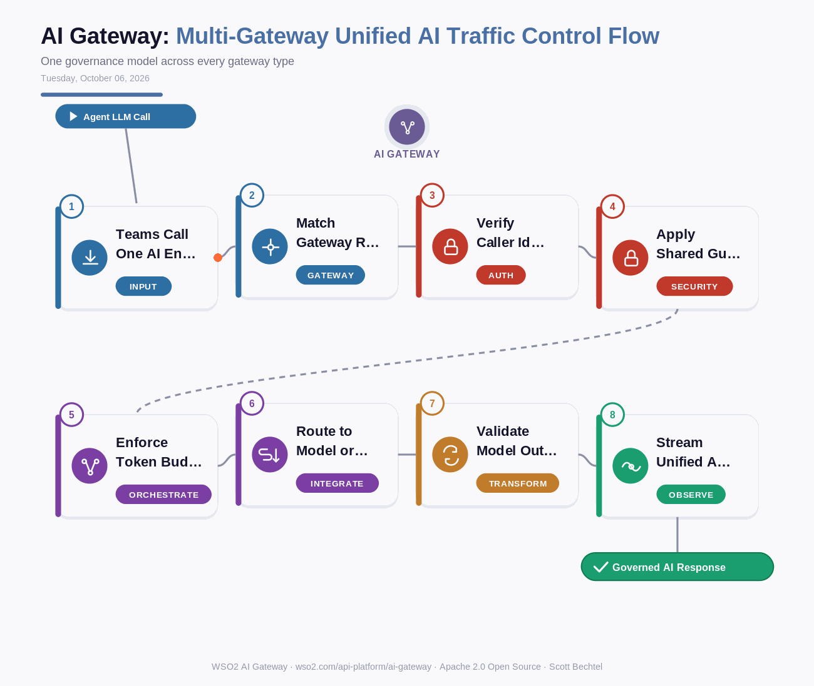

# AI Gateway: Multi-Gateway Unified AI Traffic Control Flow
**Date:** Tuesday, October 06, 2026  **Product:** [AI Gateway](https://wso2.com/api-platform/ai-gateway/)

## Business Problem

Most shops end up with an AI gateway per environment: one for the VM estate, another for Kubernetes, a locked-down image for regulated workloads, and something separate for event streams. Each one grows its own guardrail rules and rate limits, so the same prompt gets different treatment depending on where it lands. Finance sees four token bills and security audits four policy sets.

## How WSO2 Solves This

WSO2 AI Gateway runs on Universal, Kubernetes, Immutable, and Event gateways, and all of them answer to one control plane. You write guardrails, token limits, and routing rules once and every gateway enforces them the same way. LLM calls going out and MCP tools coming in follow the same governance model, so analytics roll up into one view of spend, latency, and policy hits. Teams pick the runtime that fits the workload and nobody has to re-implement the rules.

## Patterns Used

- Control Plane / Data Plane Separation
- Policy-as-Configuration
- Centralized Observability
- Zero Trust Security

## Architecture

---
WSO2 AI Gateway · wso2.com/api-platform/ai-gateway ·  by, Scott Bechtel
