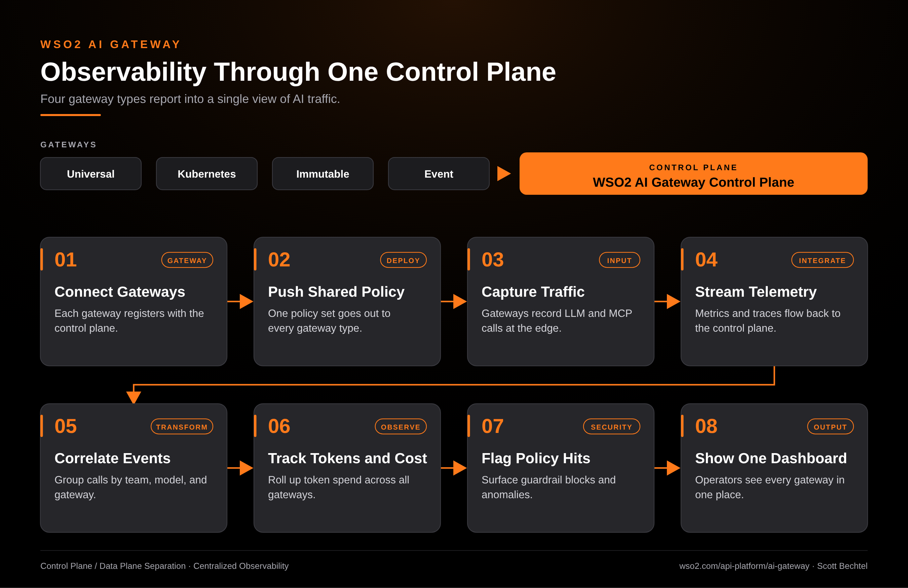

# AI Gateway: Observability Through One Control Plane
**Date:** Tuesday, October 06, 2026  **Product:** [AI Gateway](https://wso2.com/api-platform/ai-gateway/)

## Business Problem

When AI traffic runs across Universal, Kubernetes, Immutable, and Event gateways, each one ends up with its own logs and dashboards. Nobody can answer a simple question like which team spent the most tokens this week, or which gateway blocked the most prompts, without stitching four sources together by hand.

## How WSO2 Solves This

Every WSO2 AI Gateway type connects to one control plane. The control plane pushes shared policy out and pulls metrics, traces, and policy hits back in. Operators get one view of token spend, latency, and guardrail activity across all four gateways, grouped by team, model, and gateway.

## Patterns Used

- Control Plane / Data Plane Separation
- Centralized Observability

## Architecture

---
WSO2 AI Gateway · wso2.com/api-platform/ai-gateway ·  by, Scott Bechtel
