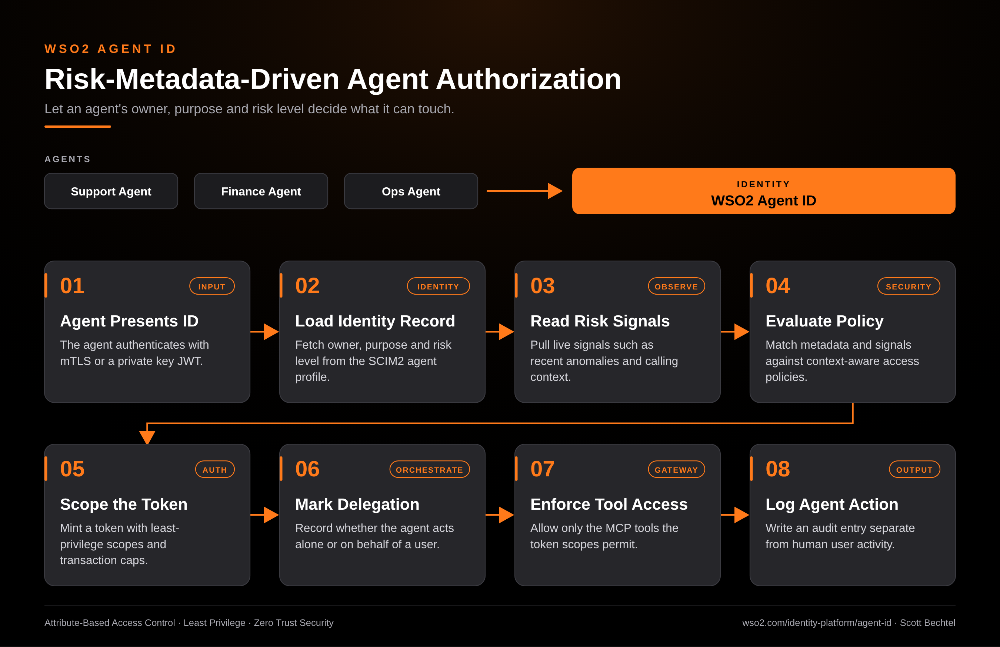

# Agent ID: Risk-Metadata-Driven Agent Authorization

**Date:** 2026-10-07  **Product:** [Agent ID](https://wso2.com/identity-platform/agent-id/)

## Business Problem

Most agent access today is decided by a static role or a shared service account. That tells you nothing about who owns the agent, what it is for, or how risky it is acting right now. A finance agent and a support agent end up with the same blast radius, and nobody can say why.

## How WSO2 Solves This

WSO2 Agent ID gives each agent its own identity record with owner, purpose and risk level. When the agent authenticates with mTLS or a private key JWT, the policy engine reads that metadata plus live risk signals and decides what to grant. The token comes back with least-privilege scopes and transaction caps, marked as either independent or on behalf of a user. MCP tool access is limited to what those scopes allow, and every action lands in an audit trail kept apart from human activity.

## Patterns Used

- Attribute-Based Access Control
- Least Privilege
- Zero Trust Security

## Architecture

---
WSO2 Agent ID · wso2.com/identity-platform/agent-id ·  by, Scott Bechtel
