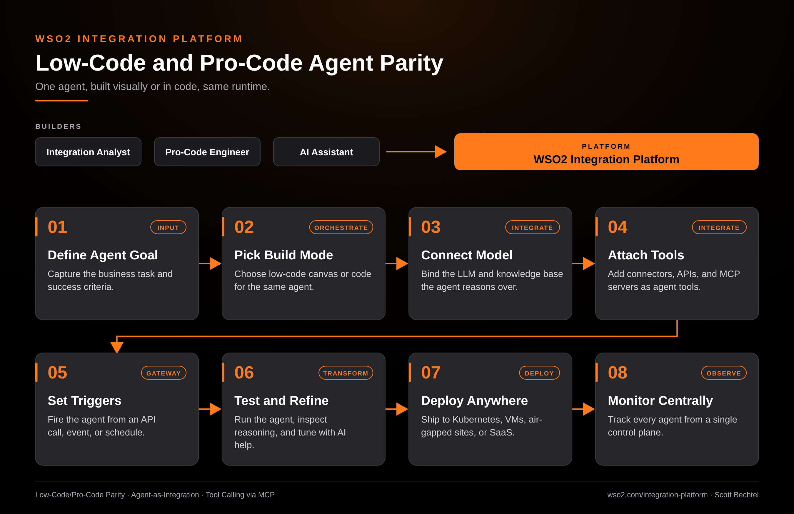

# WSO2 Integration Platform: Low-Code and Pro-Code Agent Parity

**Date:** 2026-10-08  **Product:** [WSO2 Integration Platform](https://wso2.com/integration-platform/)

## Business Problem

Agent projects stall when the people who know the business process and the people who write production code can't work on the same thing. Analysts prototype in one tool, engineers rebuild it in another, and the rewrite drifts from what the business asked for. Every handoff adds weeks and a new place for the agent's behavior to change.

## How WSO2 Solves This

The WSO2 Integration Platform gives low-code and pro-code builders parity, so the same agent can start on a visual canvas and finish in code, or the other way around, without a rewrite. Either path connects the agent to models, knowledge bases, 600+ connectors, APIs, and MCP servers, then triggers it from an API call, an event, or a schedule. AI-assisted development speeds up both modes. When it is ready, you deploy to Kubernetes, VMs, air-gapped sites, or SaaS and watch every agent from one control plane.

## Patterns Used

- Low-Code/Pro-Code Parity
- Agent-as-Integration
- Tool Calling via MCP

## Architecture

WSO2 Integration Platform · wso2.com/integration-platform ·  by, Scott Bechtel
