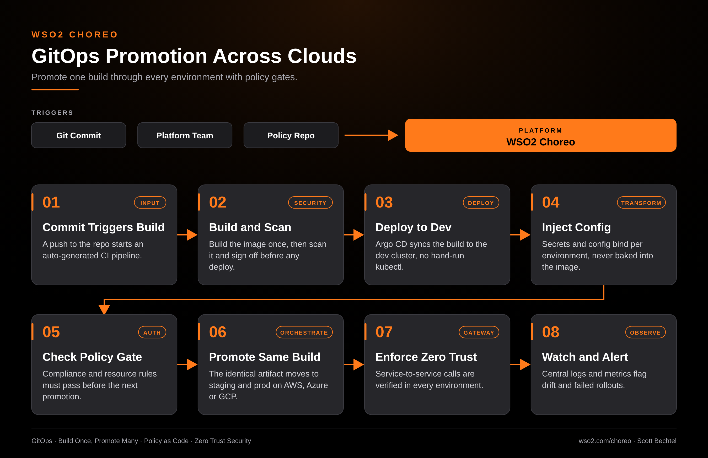

# Choreo: GitOps Promotion Across Clouds

**Date:** 2026-10-09  **Product:** [Choreo](https://wso2.com/choreo/)

## Business Problem

A release that works in dev and breaks in production usually means the artifact changed somewhere along the way. Teams that run Kubernetes on more than one cloud end up with a different pipeline per cluster, and compliance checks that live in a wiki instead of in the path to production.

## How WSO2 Solves This

Choreo generates the CI pipeline from your repo and builds the image once. Argo CD and Flux handle the GitOps sync under the hood, so the same artifact moves from dev to staging to prod across AWS, Azure, or GCP. Config and secrets bind per environment, and policy gates have to pass before each promotion. Platform teams keep control of the pipeline, and developers get a self-service portal instead of a ticket queue.

## Patterns Used

- GitOps
- Build Once, Promote Many
- Policy as Code
- Zero Trust Security

## Architecture

---
WSO2 Choreo · wso2.com/choreo ·  by, Scott Bechtel
