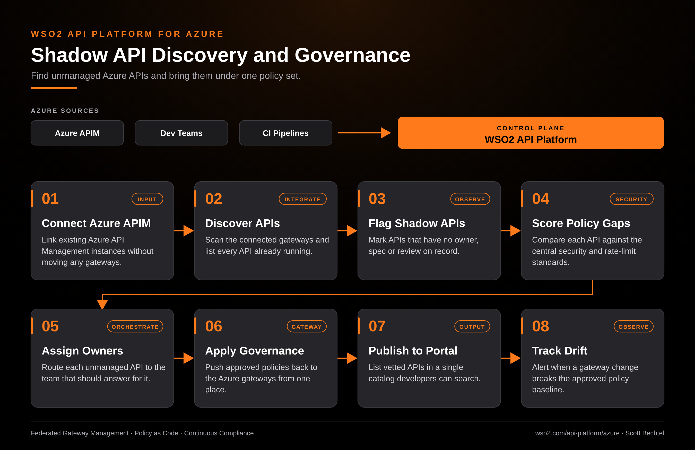

# API Platform for Azure: Shadow API Discovery and Governance

**Date:** 2026-10-10  **Product:** [API Platform for Azure](https://wso2.com/api-platform/azure/)

## Business Problem

Teams ship APIs to Azure API Management faster than anyone reviews them. Over time the platform group loses track of which APIs exist, who owns them, and whether they meet the security standard. The ones nobody listed are the ones that surface in an audit.

## How WSO2 Solves This

WSO2 API Platform for Azure connects to the Azure API Management instances you already run, so no gateway has to move. It discovers what is deployed, flags APIs with no owner or spec, and scores each one against your central policies. Approved policies go back to the Azure gateways from one control plane, and vetted APIs show up in a single catalog. When someone changes a gateway and breaks the baseline, you hear about it.

## Patterns Used

- Federated Gateway Management
- Policy as Code
- Continuous Compliance

## Architecture

WSO2 API Platform for Azure · wso2.com/api-platform/azure ·  by, Scott Bechtel
